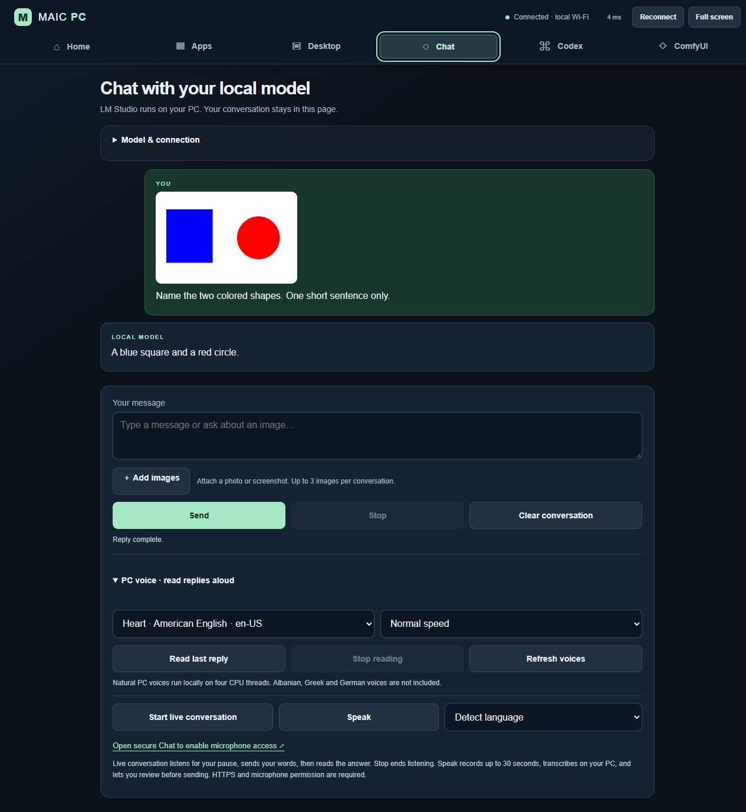

# PC Remote

Turn a phone, tablet, or spare Android touchscreen into a companion for your Windows PC. Use a browser for desktop control, app launching, audio controls, local AI chat, and ComfyUI previews.

The project began as a dashboard for an MLS MAIC iQR70. **No MAIC hardware, Android installation, root, or OS reset is required.** PC Remote runs on Windows; your other device opens its web page. Some scripts keep the original `MAIC` name for compatibility.

## Features

- **Home:** volume, speaker and PC microphone mute, media keys, CPU/RAM and supported NVIDIA GPU metrics, saved websites, calculator, and timer.
- **Apps:** searchable installed Windows apps, favourites, running indicators, and open/switch actions. Windows may refuse foreground activation; PC Remote reports that instead of claiming success.
- **Desktop:** authenticated noVNC screen control. One finger clicks/drags Windows; two fingers pan/pinch the local view in Control mode. Includes Fit, zoom, touch keyboard, scrolling, keys, View only, fullscreen, and bounded reconnection.
- **Codex:** open the installed ChatGPT/Codex desktop application in a separate browser workspace using the same desktop connection. This shares the signed-in Windows desktop, rather than isolating one application.
- **Chat:** select an LM Studio model, stream replies, attach images when the selected model supports vision, stop generation, and clear the conversation. Optional PC-generated speech reads replies; optional local Whisper dictation turns recorded speech into editable text.
- **ComfyUI:** read-only queue counts and recent images/videos. Compatible video previews leave originals untouched. No workflow submission or queue changes.
- **Away from home:** optional HTTPS gateway with browser pairing, local-PC approval, revocation, and authenticated desktop WebSockets.

The PC must remain awake, online, and signed in. There is no pre-login control or wake-from-internet feature.



## Requirements

- Windows 10/11, 64-bit, and **Python 3.11 or 3.12, 64-bit** from [python.org](https://www.python.org/downloads/windows/).
- A trusted local network and a browser on the phone/tablet. Chrome 78 compatibility is retained for older Android devices; current browsers are recommended. OEM browser microphone/fullscreen support can vary.
- For desktop viewing, install [7-Zip](https://www.7-zip.org/) so setup can extract the verified official TightVNC archive without running its installer.
- Optional: [LM Studio](https://lmstudio.ai/) for local AI, [ComfyUI](https://github.com/Comfy-Org/ComfyUI) for generation previews, [Tailscale](https://tailscale.com/download/windows) for secure internet access, and the ChatGPT/Codex desktop app for the Codex shortcut.

Base Python dependencies are pinned in `requirements.txt`. The Windows audio controls use standard-library Core Audio bindings; pycaw/comtypes are not required. Large model files and private machine settings are not included in the repository.

## Install on your PC

Download or clone this repository into a permanent folder, then open PowerShell in that folder. Run as your normal Windows user:

```powershell
powershell.exe -NoProfile -ExecutionPolicy Bypass -File .\Install-PCRemote.ps1
```

The installer creates a project-local `.venv`, installs dependencies, prepares the optional desktop server, and creates **Desktop → MAIC PC → Start, Stop, Open Dashboard, Help**. It also creates current-user login startup. It does not alter router settings, enable internet sharing, add firewall rules, or download LM Studio models.

Useful options:

```powershell
# Read-only prerequisite check; no installation or configuration changes.
.\Install-PCRemote.ps1 -CheckOnly

# Choose Python or a LAN interface explicitly if automatic detection is ambiguous.
.\Install-PCRemote.ps1 -PythonPath 'C:\Python311\python.exe' -InterfaceAlias 'Wi-Fi'

# App/audio/chat dashboard without preparing desktop viewing.
.\Install-PCRemote.ps1 -DashboardOnly

# Opt in to about 678 MB of Kokoro/Whisper assets plus runtime dependencies.
.\Install-PCRemote.ps1 -WithSpeech
```

If reinstalling this same folder, stop its running dashboard first. Setup preserves bookmarks, favourites, approvals, and existing Tailscale routes. Keep the project folder in place; rerun setup if you move it. If Windows Firewall prompts, allow the Python server on your trusted **Private** network. If your organisation manages firewall access, follow its policy.

## Connect a phone or tablet on the same network

1. Open the **Start** desktop shortcut on the Windows PC. It starts the server and opens the current dashboard address.
2. Find the phone/tablet's Wi-Fi IPv4 address in its network settings. On the Windows PC, approve that device:

   ```powershell
   .\Approve-MAIC.ps1 -Address '192.168.1.50'
   ```

   Replace the example with your device's actual address. LAN approval is IP-based and intended for your trusted private network; remove stale approvals from `.runtime/control-access.json` when an address changes.
3. Open the PC dashboard address from step 1 on the phone/tablet. Bookmark it. On the Desktop page, press **Connect desktop**.

The current address is also stored in `.runtime/server.url`. `localhost` on the phone refers to the phone, not your Windows PC. App buttons open programs on Windows; website buttons open pages on the device. Other web apps need their own network availability.

**Desktop touch:** stay in Control for one-finger Windows input and two-finger pan/zoom. Optional Pan only moves the view with one finger; View only blocks Windows input. Use the Keyboard button to type into the focused Windows field. Fullscreen requires a browser-supported user tap.

## Local AI, images, and speech

LM Studio is reached only by the PC backend at `127.0.0.1:1234`. Start its localhost API from Chat or LM Studio. Select a loaded model explicitly; the dashboard can also load an already installed model when you request it. It never substitutes a different model or downloads one automatically.

Image attachments require a vision-capable selected model. You can review/remove attachments before sending. Unsupported or oversized images produce an error rather than being silently dropped. Chat stays in browser memory; reloading clears it. Existing LM Studio desktop conversations are not imported.

Quick model buttons are shown only when the matching model is already installed: Qwen3.5 0.8B Q8, Qwen3.5 2B, and Liquid LFM2.5 1.2B. Choosing one is explicit and does not download it. Actual speed depends on your hardware and the model's settings; Liquid's text-only choice does not accept images.

**Start live conversation** provides hands-free, turn-based interaction: it listens until your pause, transcribes and sends the words, generates a reply, reads it aloud, then listens again. It is not simultaneous full-duplex audio. Select a model and prepare both speech components first. Stop ends the loop; microphone and browser audio permissions still apply.

**Read aloud** uses the optional PC speech setup, not the phone's installed voice. `Install-PCRemote.ps1 -WithSpeech` prepares both speech output and dictation during installation. To add just speech output after setup, use:

```powershell
.\.venv\Scripts\python.exe -X utf8 .\tools\setup_pc_speech.py
```

The helper verifies fixed Kokoro model/voice hashes and installs its separate runtime. Runtime requests never download models. Available voices/languages are shown by the dashboard; unsupported languages are reported. Third-party model licensing is described in `THIRD_PARTY_NOTICES.md`.

**Speak** is separate dictation: it records up to 30 seconds on the browser device, transcribes on the PC, and inserts editable text before Send. HTTPS and microphone permission are required. To add just dictation after setup, use:

```powershell
.\.venv\Scripts\python.exe -X utf8 .\tools\setup_dictation.py
```

This explicit helper installs pinned recognition dependencies and verifies/downloads a fixed multilingual Whisper small revision, about 486 MB of model files. `--check` validates an existing local installation without installing or downloading. The service reuses a complete existing small/base model cache with four CPU threads and never downloads during recording. Some Android WebViews deny microphone capture even with HTTPS; typed input always remains available.

ComfyUI uses the local service on `127.0.0.1:8010`. Configure your ComfyUI instance to listen there if you want this integration. Its protected or unrelated endpoints are not bypassed. Video conversion needs FFmpeg available on the PC; unavailable conversion is reported rather than modifying source videos.

## Secure access away from home

Internet access is optional and separate from installation. Install and sign in to Tailscale on the Windows PC; enable HTTPS/Funnel support for your account according to [Tailscale's documentation](https://tailscale.com/docs/features/tailscale-funnel). Then run:

```powershell
.\Setup-MAIC-Remote.ps1 -PythonPath .\.venv\Scripts\python.exe
.\Stop-MAIC.ps1
.\Start-MAIC.ps1
.\Setup-MAIC-Remote.ps1 -PythonPath .\.venv\Scripts\python.exe -EnableFunnel
```

Setup configures only the dedicated HTTPS port **8443**, pointing at the authenticated loopback gateway on **8842**, and verifies that unrelated existing Tailscale routes remain unchanged. It refuses conflicting routes. It does not require port-forwarding your router or installing Tailscale on the browser device. Funnel is a public HTTPS address whose dashboard access is protected by PC Remote's pairing; provider/account and bandwidth limitations apply.

Open the resulting secure link shown on Home. A new browser sees **Connect to your PC**. Request connection, then approve the matching code on the Windows PC's local dashboard. Bookmark the secure address before travelling. Only the local PC can approve/revoke devices; the internet gateway blocks those management actions. A workplace firewall may block this address or port.

Credentials stay out of URLs and logs. Pairing requests expire after ten minutes; approved browser sessions expire after thirty days. Revocation closes remote desktop connections. Do not share your private `.runtime` folder or approve unfamiliar requests.

## Startup, ports, and troubleshooting

- **Start/Open Dashboard:** start the server if needed and open its current address. Windows login startup waits up to 90 seconds for the chosen LAN interface. Multiple starts reuse the same owned server.
- **Stop:** stop only this project's owned dashboard/viewer processes. Other programs remain running. Remove the `MAIC PC.lnk` shortcut from your current-user Startup folder to disable sign-in startup.
- **Address changed:** stop and start the dashboard, then use the new address saved in `.runtime/server.url`. Secure access uses the configured hostname. To select a different physical interface, stop the dashboard and rerun setup with `-InterfaceAlias`.
- **Logs:** `.runtime/startup-error.log`, `.runtime/server.err.log`, `.runtime/desktop-start-error.log`, and `.runtime/shortcut-error.log`. These local files should not be published.
- **LAN dashboard:** 8840. **LAN desktop bridge:** 8841. **Optional HTTPS gateway:** loopback 8842. **TightVNC:** loopback 5900 only; no direct VNC LAN listener. Keep these ports free.
- **Desktop unavailable:** confirm 7-Zip and run `Setup-Desktop-Viewer.ps1` with the project Python. Existing unrelated VNC servers are not replaced. TightVNC is run in user-session mode, not installed as a pre-login service.
- **Blank mobile UI:** refresh the page after an update. Check that both devices can reach the PC; guest Wi-Fi networks may isolate clients.

Never expose the LAN HTTP/desktop ports directly to the internet. The optional authenticated HTTPS gateway is the supported internet route.

## Development and validation

```powershell
.\.venv\Scripts\python.exe -m pip install pytest pytest-subtests numpy==2.4.3
.\.venv\Scripts\python.exe -X utf8 -m pytest tests -q
node tests/test_desktop_viewer.js
node tests/test_app_ui.js
node tests/test_voice.js
node tests/test_chat_media.js
powershell.exe -NoProfile -File .\tests\Test-Startup.ps1 -SkipShortcuts
powershell.exe -NoProfile -File .\tests\Test-RemoteSetup.ps1
```

The test suite covers app IDs, access boundaries, desktop tickets/origins, gestures/input release, chat streaming/cancellation, image validation, speech behavior, read-only Comfy access, startup ownership, and network selection. `-SkipShortcuts` lets startup tests run before machine shortcuts are installed. Tests do not prove physical microphone permissions, touch feel, sign-in behavior after an actual reboot, or access through every workplace firewall; verify those on your own devices.

`tools/Build-Desktop-Viewer.ps1` rebuilds the pinned noVNC bundle, obtaining the checksum-verified esbuild tool from the official npm registry if missing. Windows' `tar` command is needed for that first extraction. Keep bundled third-party source and license notices intact. Private settings, downloaded binaries/models, device QR codes, and virtual environments are excluded from Git. Do not publish a copy of your working `.runtime` directory.

## License

PC Remote's original code is **MIT licensed**: use, modify, and redistribute it, including commercially, while retaining the copyright and license notice. Bundled noVNC and optional dependencies retain their own licenses; see [THIRD_PARTY_NOTICES.md](THIRD_PARTY_NOTICES.md).
